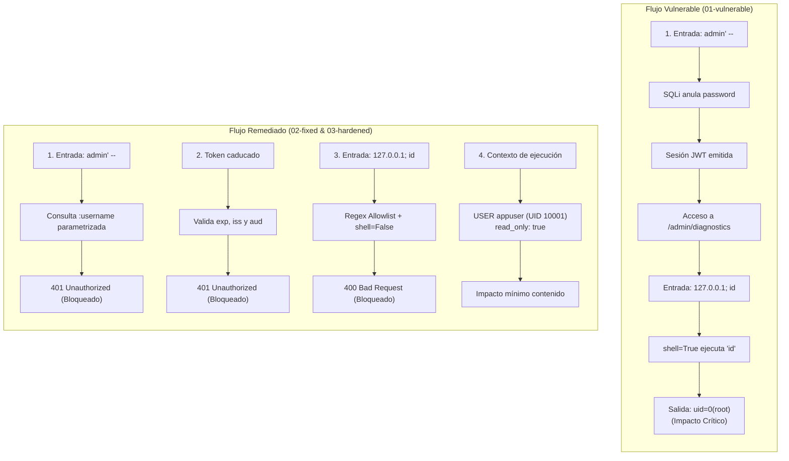
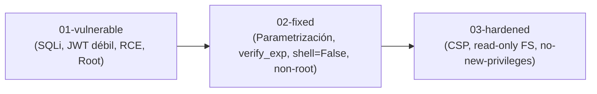
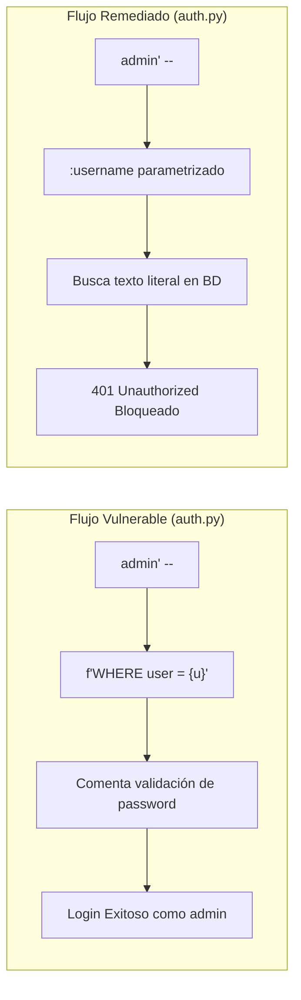
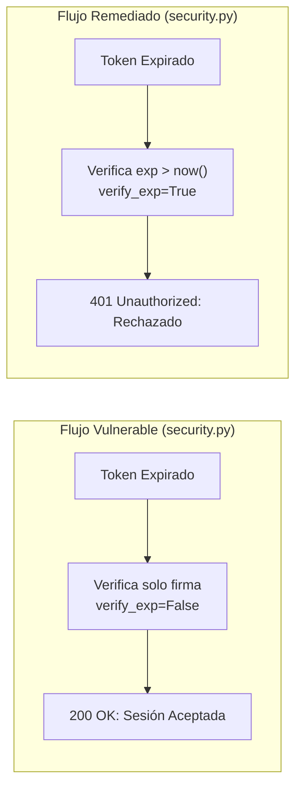
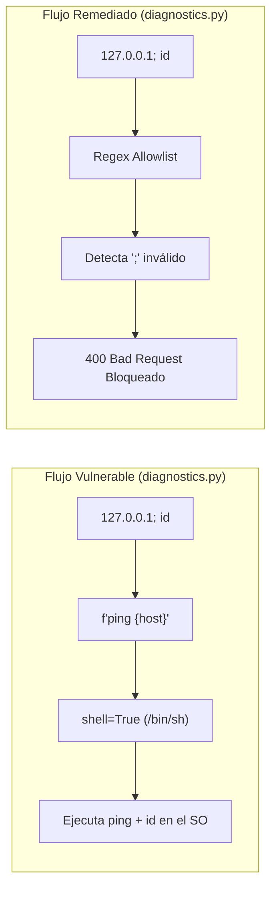
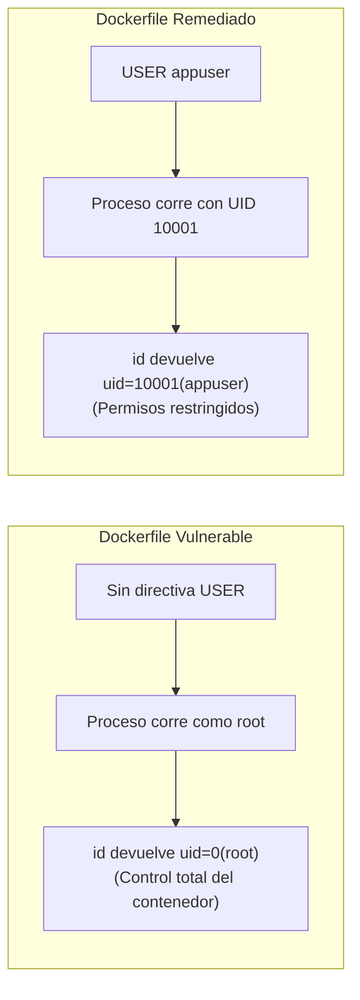
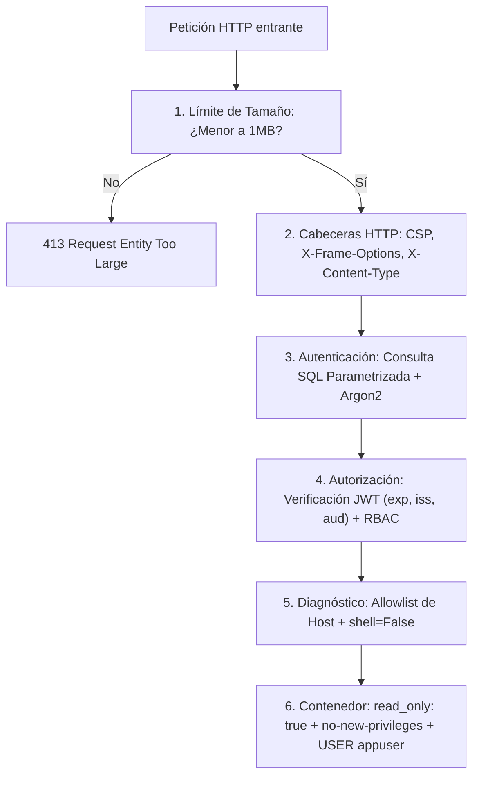
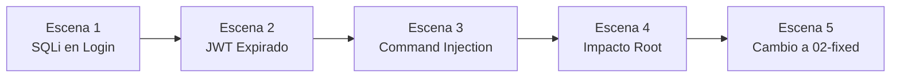

# OpsDesk — Laboratorio de Secure Coding

> [!CAUTION]
> ### ⚠️ ADVERTENCIA: APLICACIÓN DELIBERADAMENTE VULNERABLE
> Este repositorio contiene código vulnerable con fines **estrictamente educativos y de demostración**.
>
> **REGLAS FUNDAMENTALES DE SEGURIDAD:**
> - **NO** exponer esta aplicación a Internet ni a redes públicas o corporativas no aisladas.
> - **NO** desplegar en entornos productivos ni en la nube.
> - **NO** utilizar contraseñas, secretos, tokens o datos personales reales.
> - **NO** conectar esta base de datos a servicios o sistemas externos.

---

## Índice

1. [Arquitectura y Comparativa General](#1-arquitectura-y-comparativa-general)
2. [Puesta en Marcha Rápida](#2-puesta-en-marcha-rápida)
3. [Cuentas Preconfiguradas](#3-cuentas-preconfiguradas)
4. [Estructura de Versiones (Ramas Git)](#4-estructura-de-versiones-ramas-git)
5. [Vulnerabilidad 1: SQL Injection en Autenticación](#5-vulnerabilidad-1-sql-injection-en-autenticación)
6. [Vulnerabilidad 2: Validación Incompleta de JWT](#6-vulnerabilidad-2-validación-incompleta-de-jwt)
7. [Vulnerabilidad 3: Command Injection en Diagnóstico](#7-vulnerabilidad-3-command-injection-en-diagnóstico)
8. [Vulnerabilidad 4: Proceso de Contenedor Ejecutado como Root](#8-vulnerabilidad-4-proceso-de-contenedor-ejecutado-como-root)
9. [Defensa en Profundidad (Hardening)](#9-defensa-en-profundidad-hardening)
10. [Guion de Presentación en Vivo (Paso a Paso)](#10-guion-de-presentación-en-vivo-paso-a-paso)

---

## 1. Arquitectura y Comparativa General

**OpsDesk** es un portal interno desarrollado en **Python 3.13**, **FastAPI**, **Jinja2** y **PostgreSQL**.

### Diagrama de Flujo: Cadena de Ataque vs Cadena Defensiva



### Controles de contención del laboratorio:
- **Enlace a Localhost:** La aplicación web escucha exclusivamente en `127.0.0.1:8000`.
- **Aislamiento de Base de Datos:** PostgreSQL no publica puertos al host; solo es accesible en la red puente de Docker.
- **Sin Privilegios Especiales:** No se utiliza `--privileged`, no se monta `/var/run/docker.sock` ni directorios sensibles del host.
- **Comandos Inocuos:** Las demostraciones de inyección se acotan a comandos de solo lectura como `id`, `whoami` o `pwd`.

---

## 2. Puesta en Marcha Rápida

Para iniciar todo el entorno en un único paso:

```bash
docker compose up --build
```

Acceder desde el navegador:
👉 **[http://127.0.0.1:8000](http://127.0.0.1:8000)**

Para reiniciar la base de datos y limpiar volúmenes en cualquier momento:
```bash
docker compose down -v
docker compose up --build
```

---

## 3. Cuentas Preconfiguradas

La base de datos se inicializa automáticamente con tres cuentas:

| Usuario | Contraseña | Rol | Alcance / Permisos |
| :--- | :--- | :--- | :--- |
| `alice` | `alice123` | `user` | Usuario estándar (Dashboard y Tickets) |
| `bob` | `bob123` | `user` | Usuario estándar (Dashboard y Tickets) |
| `admin` | `admin123` | `admin` | Administrador (acceso a `/admin` y Diagnóstico de Red) |

---

## 4. Estructura de Versiones (Ramas Git)

El repositorio cuenta con tres ramas principales para contrastar los cambios:



```bash
# 1. Versión 100% vulnerable:
git checkout 01-vulnerable

# 2. Versión con correcciones de código:
git checkout 02-fixed

# 3. Versión endurecida con defensa en profundidad:
git checkout 03-hardened
```

Para ver la diferencia exacta de código entre fases:
```bash
git diff 01-vulnerable 02-fixed
git diff 02-fixed 03-hardened
```

---

## 5. Vulnerabilidad 1: SQL Injection en Autenticación

### Causa raíz
El formulario de inicio de sesión toma las entradas del usuario (`username` y `password`) y las concatena directamente en una consulta SQL en texto plano mediante un f-string de Python.

### Diagrama de Flujo: SQL Injection



### Código Inseguro ([`app/auth.py`](file:///home/zerotwo/security_presentation_example/app/auth.py))
```python
def authenticate_user_vulnerable(db: Session, username: str, password: str) -> Optional[dict]:
    # INSEGURO: El contenido del usuario se vuelve parte de la sintaxis SQL
    raw_query = f"SELECT id, username, password, role FROM users WHERE username = '{username}' AND password = '{password}'"
    
    result = db.execute(text(raw_query)).fetchone()
    if result:
        return {"id": result[0], "username": result[1], "role": result[3]}
    return None
```

### Paso a paso de la demostración
1. Navegar a `http://127.0.0.1:8000/login`.
2. En el campo **Username**, introducir:
   ```text
   admin' --
   ```
3. En el campo **Password**, introducir cualquier texto arbitrario (ej. `x`).
4. Al enviar el formulario, la consulta evaluada en el motor SQL resulta en:
   ```sql
   SELECT id, username, password, role FROM users WHERE username = 'admin' --' AND password = 'x'
   ```
5. La secuencia `--` comenta el resto de la línea SQL (la comprobación de contraseña).
6. El motor devuelve el registro del usuario `admin`, emitiendo una sesión de administrador válida.

### Cómo se arregla desde el código ([`app/auth.py`](file:///home/zerotwo/security_presentation_example/app/auth.py))
```python
def authenticate_user_secure(db: Session, username: str, password: str) -> Optional[dict]:
    # SEGURO 1: Consulta parametrizada. El valor :username viaja como dato puro, no como código ejecutable
    query = text("SELECT id, username, password, role FROM users WHERE username = :username")
    result = db.execute(query, {"username": username}).fetchone()
    
    if not result:
        return None

    stored_password_hash = result[2]

    # SEGURO 2: Hashing con Argon2id y verificación en tiempo constante
    try:
        if ph.verify(stored_password_hash, password):
            return {"id": result[0], "username": result[1], "role": result[3]}
    except VerifyMismatchError:
        return None
        
    return None
```

---

## 6. Vulnerabilidad 2: Validación Incompleta de JWT

### Causa raíz
Tener una firma criptográfica válida en un JWT **no implica** que el token sea aceptable. En la versión defectuosa se verifica la firma HMAC pero se desactiva explícitamente la comprobación del tiempo de expiración (`exp`), emisor (`iss`) y audiencia (`aud`).

### Diagrama de Flujo: Validación JWT



### Código Inseguro ([`app/security.py`](file:///home/zerotwo/security_presentation_example/app/security.py))
```python
def decode_token_vulnerable(token: str) -> dict:
    # INSEGURO: Se verifica la firma pero se ignoran los claims críticos
    return jwt.decode(
        token,
        settings.JWT_SECRET,
        algorithms=[settings.JWT_ALGORITHM],
        options={
            "verify_signature": True,
            "verify_exp": False,  # <--- DEFECTO: Acepta tokens expirados indefinidamente
            "verify_iss": False,  # <--- Ignora emisor esperado
            "verify_aud": False,  # <--- Ignora audiencia esperada
        },
    )
```

### Paso a paso de la demostración
1. Iniciar sesión y observar en el **Dashboard** la tarjeta *JWT Claims Inspector*.
2. Generar o enviar un token con fecha de expiración en el pasado:
   ```bash
   make demo-jwt
   ```
3. En la versión vulnerable, el servidor responde con **HTTP 200 OK**, aceptando la sesión caducada.
4. **Punto pedagógico:** *"Firma válida no equivale a token válido."*

### Cómo se arregla desde el código ([`app/security.py`](file:///home/zerotwo/security_presentation_example/app/security.py))
```python
def decode_token_secure(token: str) -> dict:
    # SEGURO: Validación exhaustiva de todas las propiedades del token
    return jwt.decode(
        token,
        settings.JWT_SECRET,
        algorithms=[settings.JWT_ALGORITHM], # Algoritmo fijado explícitamente (HS256)
        issuer=settings.JWT_ISSUER,          # Valida que iss == "opsdesk"
        audience=settings.JWT_AUDIENCE,      # Valida que aud == "opsdesk-web"
        options={
            "verify_signature": True,
            "verify_exp": True,              # Exige y verifica tiempo de expiración
            "verify_iss": True,
            "verify_aud": True,
            "require": ["exp", "iss", "aud", "sub", "username", "role"],
        },
    )
```

---

## 7. Vulnerabilidad 3: Command Injection en Diagnóstico

### Causa raíz
En la utilidad de diagnóstico de red (`/admin/diagnostics`), el parámetro ingresado por el usuario se concatena en un string que se entrega a una shell del sistema operativo mediante `subprocess.run(cmd, shell=True)`.

### Diagrama de Flujo: Command Injection



### Código Inseguro ([`app/diagnostics.py`](file:///home/zerotwo/security_presentation_example/app/diagnostics.py))
```python
def run_diagnostics_vulnerable(host: str) -> str:
    # INSEGURO: Entrada concatenada ejecutada a través de la shell
    cmd = f"ping -c 1 {host}"
    
    proc = subprocess.run(
        cmd,
        shell=True,
        capture_output=True,
        text=True,
        timeout=5,
    )
    return proc.stdout if proc.stdout else proc.stderr
```

### Paso a paso de la demostración
1. Iniciar sesión como administrador (`admin / admin123`).
2. Ingresar a `/admin/diagnostics`.
3. Probar un ping normal: `127.0.0.1`.
4. Ingresar una carga con metacaracteres de control de shell:
   ```text
   127.0.0.1; id
   ```
5. Pulsar **Ping**.
6. La salida en la página muestra los datos de usuario del sistema operativo:
   ```text
   uid=0(root) gid=0(root) groups=0(root)
   ```

### Cómo se arregla desde el código ([`app/diagnostics.py`](file:///home/zerotwo/security_presentation_example/app/diagnostics.py))
```python
# SEGURO 1: Allowlist estricta para validar IPs o hostnames RFC 1123
if not is_valid_target(target):
    raise ValueError(f"Formato de host o IP inválido: '{target}'. Metacaracteres rechazados.")

# SEGURO 2: Ejecución directa sin shell (shell=False) pasando argumentos en lista
proc = subprocess.run(
    ["ping", "-c", "1", "-W", "2", target],
    shell=False,
    capture_output=True,
    text=True,
    timeout=3,
)
```

---

## 8. Vulnerabilidad 4: Proceso de Contenedor Ejecutado como Root

### Causa raíz
En el `Dockerfile` inicial no se declara la directiva `USER`. El proceso corre con el usuario predeterminado de la imagen base: `root` (UID 0).

### Diagrama de Flujo: Contenedor Root vs Non-Root



> [!IMPORTANT]
> **Punto Pedagógico Central:**
> - Docker ejecutándose como root **NO** produce la inyección de comandos.
> - La inyección de comandos se originó por el defecto de software en Python.
> - **Sin embargo**, ejecutar el proceso como `root` magnifica el impacto: el atacante tiene control irrestricto sobre los archivos y procesos del contenedor.

### Cómo se arregla desde el código ([`Dockerfile`](file:///home/zerotwo/security_presentation_example/Dockerfile))
```dockerfile
# SEGURO 1: Creación de usuario y grupo no privilegiados (UID 10001)
RUN groupadd -g 10001 appgroup && \
    useradd -u 10001 -g appgroup -s /sbin/nologin -d /app -m appuser

COPY . .
RUN chown -R appuser:appgroup /app

# SEGURO 2: Cambio explícito de contexto al usuario no privilegiado
USER appuser
```

---

## 9. Defensa en Profundidad (Hardening)

La rama **`03-hardened`** añade controles de seguridad complementarios en múltiples capas:

### Diagrama de Flujo: Capas de Seguridad



### 1. Cabeceras HTTP Defensivas ([`app/main.py`](file:///home/zerotwo/security_presentation_example/app/main.py))
Inyección de `Content-Security-Policy`, `X-Frame-Options: DENY`, `X-Content-Type-Options: nosniff` y `Referrer-Policy`.

### 2. Limitación de Payload (Anti-DoS)
Peticiones superiores a 1 MB son rechazadas automáticamente con **HTTP 413**.

### 3. Aislamiento del Contenedor ([`docker-compose.yml`](file:///home/zerotwo/security_presentation_example/docker-compose.yml))
```yaml
web:
  read_only: true               # Sistema de archivos raíz de solo lectura
  tmpfs:
    - /tmp:rw,noexec,nosuid,size=64M  # Temp no ejecutable
  security_opt:
    - no-new-privileges:true    # Impide escalada de privilegios
  cap_drop:
    - ALL                       # Elimina Linux Capabilities
  cap_add:
    - NET_RAW                   # Mínimo indispensable para 'ping'
```

---

## 10. Guion de Presentación en Vivo (Paso a Paso)

### Diagrama de Flujo: Ruta de la Presentación



### Paso 1: SQL Injection
1. En la rama vulnerable (`01-vulnerable`), abrir `http://127.0.0.1:8000/login`.
2. En el campo usuario escribir `admin' --` y contraseña cualquiera.
3. El sistema autentica directamente como `admin` por el comentario `--`.

### Paso 2: Validación Incorrecta de JWT
1. En `/dashboard`, señalar el visor interactivo de claims del JWT.
2. Ejecutar la prueba de token caducado:
   ```bash
   make demo-jwt
   ```
3. El servidor acepta el token con código **200 OK**, demostrando que `verify_exp=False` es inseguro.

### Paso 3: Command Injection
1. Acceder a `/admin/diagnostics`.
2. Introducir `127.0.0.1; id` y pulsar **Ping**.
3. Se muestra la salida del comando del sistema operativo en el navegador.

### Paso 4: Impacto del Proceso como Root
1. Resaltar la línea `uid=0(root)` obtenida en el paso anterior.
2. Mostrar el [`Dockerfile`](file:///home/zerotwo/security_presentation_example/Dockerfile) sin directiva `USER`.

### Paso 5: Cambio a la Versión Corregida
1. Cambiar a la rama corregida:
   ```bash
   git checkout 02-fixed
   docker compose down -v && docker compose up -d
   ```
2. Repetir exactamente cada prueba anterior:
   - `admin' --` en el login &rarr; **401 Unauthorized** (consulta parametrizada).
   - `make demo-jwt` &rarr; **401 Unauthorized** (token caducado rechazado).
   - `127.0.0.1; id` en diagnósticos &rarr; **400 Bad Request** (validación de host y `shell=False`).
   - El contenedor corre con UID `10001(appuser)`.

---

## 🧪 Pruebas Automatizadas

El proyecto incluye 22 pruebas automatizadas con `pytest`:

```bash
pytest -v tests/
```
