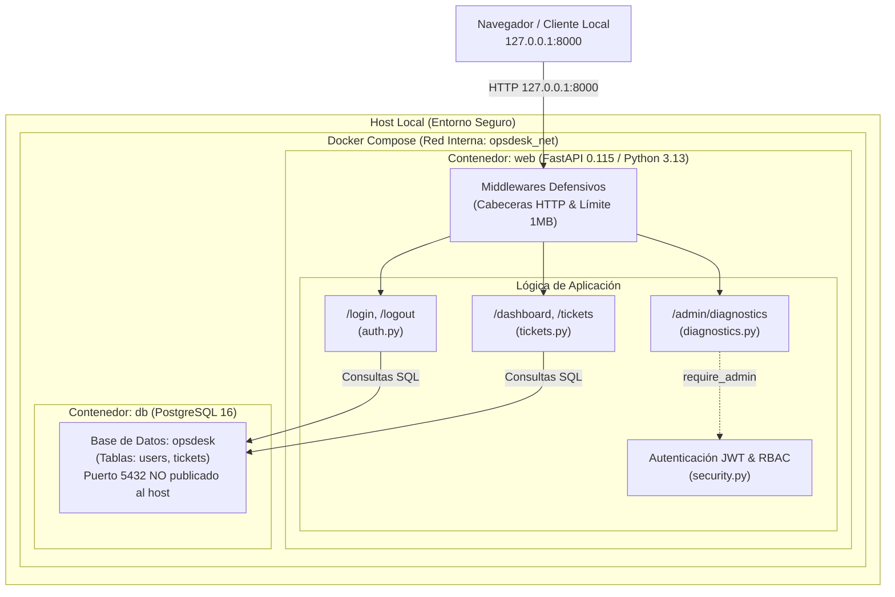
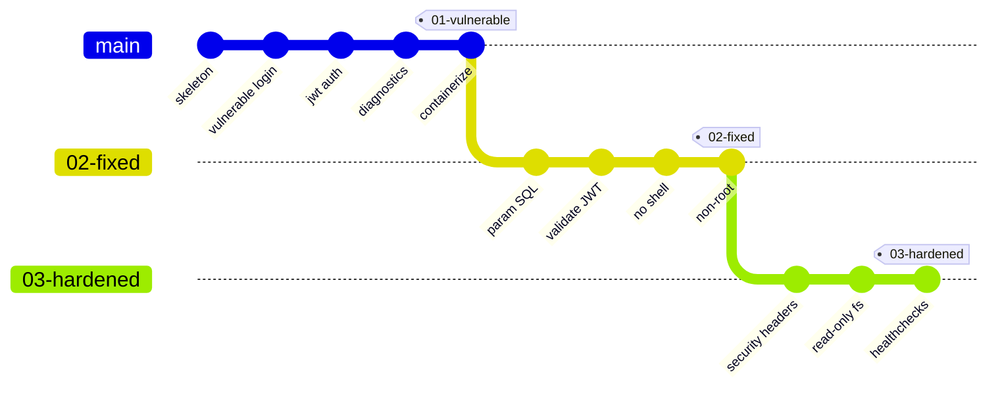
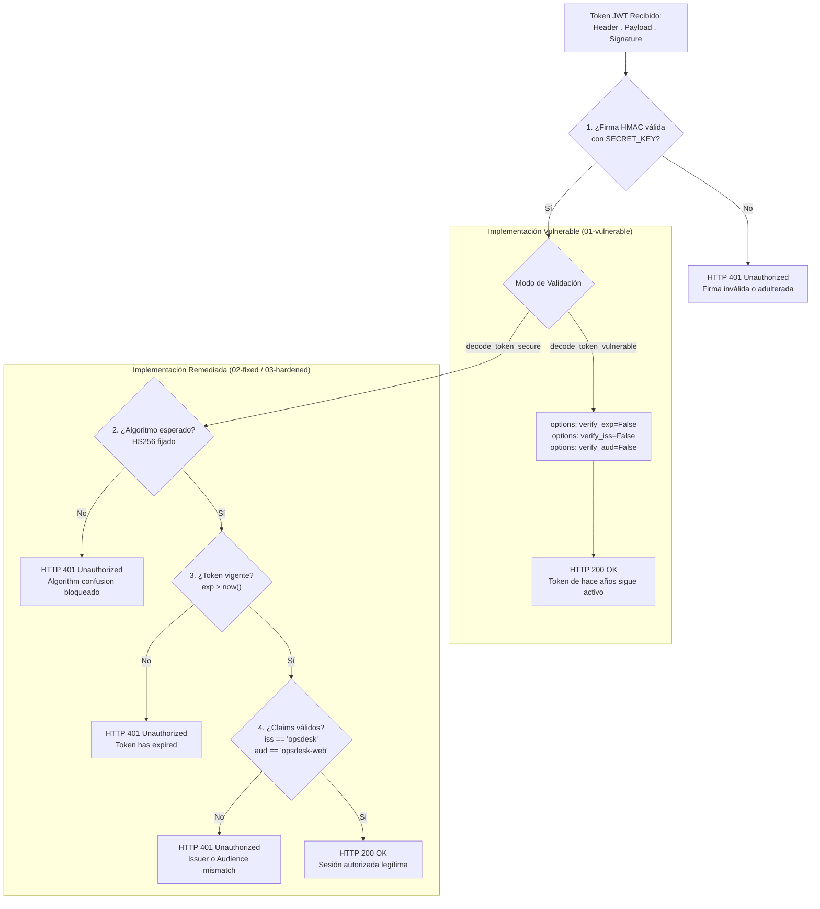
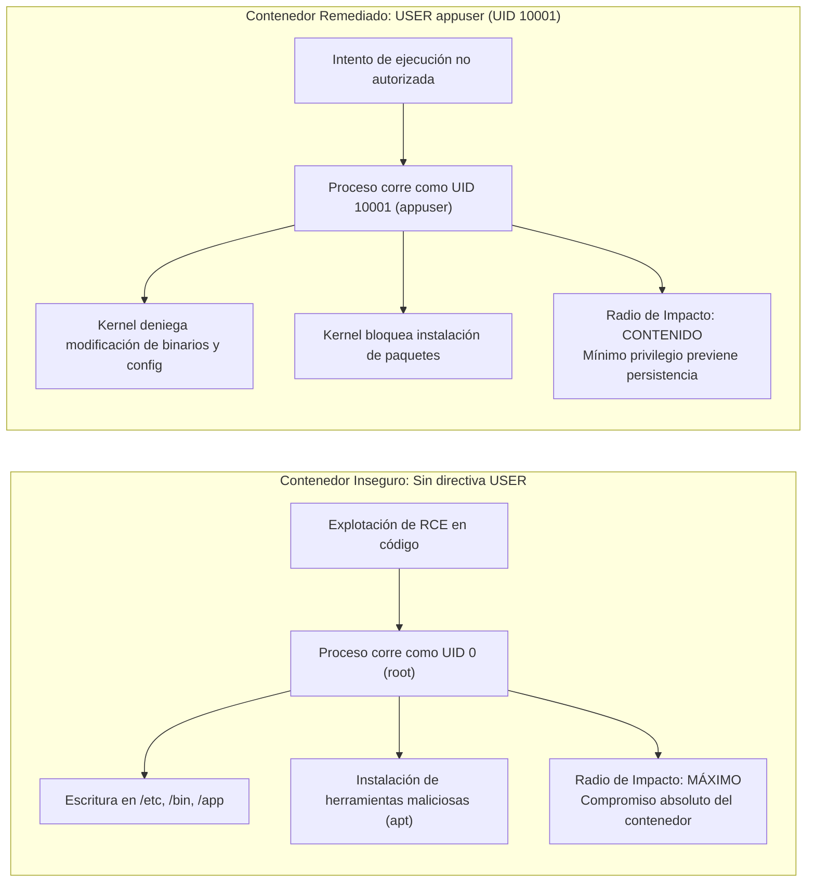
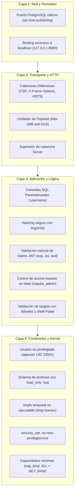

# OpsDesk — Laboratorio de Secure Coding

> [!CAUTION]
> ### ⚠️ ADVERTENCIA: APLICACIÓN DELIBERADAMENTE VULNERABLE
> Este repositorio contiene código vulnerable con fines **estrictamente educativos y de demostración**.
>
> **REGLAS FUNDAMENTALES DE SEGURIDAD:**
> - **NO** exponer esta aplicación a Internet ni a redes públicas o corporativas no aisladas.
> - **NO** desplegar en entornos productivos ni en la nube.
> - **NO** utilizar contraseñas, secretos, tokens o datos personales reales.
> - **NO** conectar esta base de datos a servicios o sistemas externos.

---

## Índice

1. [Arquitectura del Laboratorio](#1-arquitectura-del-laboratorio)
2. [Puesta en Marcha Rápida](#2-puesta-en-marcha-rápida)
3. [Cuentas Preconfiguradas](#3-cuentas-preconfiguradas)
4. [Estructura de Versiones (Ramas Git)](#4-estructura-de-versiones-ramas-git)
5. [Vulnerabilidad 1: SQL Injection en Autenticación](#5-vulnerabilidad-1-sql-injection-en-autenticación)
6. [Vulnerabilidad 2: Validación Incompleta de JWT](#6-vulnerabilidad-2-validación-incompleta-de-jwt)
7. [Vulnerabilidad 3: Command Injection en Diagnóstico](#7-vulnerabilidad-3-command-injection-en-diagnóstico)
8. [Vulnerabilidad 4: Proceso de Contenedor Ejecutado como Root](#8-vulnerabilidad-4-proceso-de-contenedor-ejecutado-como-root)
9. [Defensa en Profundidad (Hardening)](#9-defensa-en-profundidad-hardening)
10. [Guion de Presentación en Vivo (Paso a Paso)](#10-guion-de-presentación-en-vivo-paso-a-paso)

---

## 1. Arquitectura del Laboratorio

**OpsDesk** representa un portal interno de gestión de incidencias de infraestructura desarrollado con **Python 3.13**, **FastAPI**, **Jinja2** y **PostgreSQL**.

### Diagrama General de Arquitectura



### Controles de contención del laboratorio:
- **Enlace a Localhost:** La aplicación web escucha exclusivamente en `127.0.0.1:8000`.
- **Aislamiento de Base de Datos:** PostgreSQL no publica puertos al host; solo es accesible en la red puente de Docker.
- **Sin Privilegios Especiales:** No se utiliza `--privileged`, no se monta `/var/run/docker.sock` ni directorios sensibles del sistema anfitrión.
- **Comandos Inocuos:** Las demostraciones de inyección se acotan a comandos de solo lectura como `id`, `whoami` o `pwd`.

---

## 2. Puesta en Marcha Rápida

Para iniciar todo el entorno en un único paso:

```bash
docker compose up --build
```

Acceder desde el navegador:
👉 **[http://127.0.0.1:8000](http://127.0.0.1:8000)**

Para reiniciar la base de datos y limpiar volúmenes en cualquier momento:
```bash
docker compose down -v
docker compose up --build
```

---

## 3. Cuentas Preconfiguradas

La base de datos se inicializa automáticamente con tres cuentas:

| Usuario | Contraseña | Rol | Alcance / Permisos |
| :--- | :--- | :--- | :--- |
| `alice` | `alice123` | `user` | Usuario estándar (Dashboard y Tickets) |
| `bob` | `bob123` | `user` | Usuario estándar (Dashboard y Tickets) |
| `admin` | `admin123` | `admin` | Administrador (acceso a `/admin` y Diagnóstico de Red) |

---

## 4. Estructura de Versiones (Ramas Git)

El repositorio cuenta con un historial ordenado y tres ramas principales para contrastar los cambios:



```bash
# Versión 100% vulnerable:
git checkout 01-vulnerable

# Versión con correcciones de código:
git checkout 02-fixed

# Versión endurecida con defensa en profundidad:
git checkout 03-hardened
```

Para ver la diferencia exacta de código entre fases:
```bash
git diff 01-vulnerable 02-fixed
git diff 02-fixed 03-hardened
```

---

## 5. Vulnerabilidad 1: SQL Injection en Autenticación

### Causa raíz
El formulario de inicio de sesión toma las entradas del usuario (`username` y `password`) y las concatena directamente en una consulta SQL en texto plano mediante un f-string de Python.

### Diagrama de Flujo: Inseguro vs Corregido

```mermaid
flowchart TD
    subgraph FlujoInseguro["Flujo Vulnerable: Interpolación de String"]
        In1["Entrada del usuario:<br>username: admin' --<br>password: x"] --> Interp["Interpolación f-string en auth.py:<br>SELECT id, username, password, role FROM users<br>WHERE username = 'admin' --' AND password = 'x'"]
        Interp --> SQLParser1["Analizador Léxico SQL:<br>El comentario '--' anula la cláusula AND password"]
        SQLParser1 --> Exec1["Ejecución en BD:<br>WHERE username = 'admin'"]
        Exec1 --> Success1["BYPASS EXITOSO<br>Sesión de admin emitida sin conocer contraseña"]
    end

    subgraph FlujoSeguro["Flujo Remediado: Consultas Parametrizadas + Argon2"]
        In2["Entrada del usuario:<br>username: admin' --<br>password: x"] --> ParamQuery["Consulta Precompilada:<br>WHERE username = :username"]
        ParamQuery --> SQLParser2["El valor viaja en canal de datos separado<br>Se busca literalmente la cadena admin' --"]
        SQLParser2 --> FoundCheck{"¿Existe usuario con ese nombre exacto?"}
        FoundCheck -- No --> RejectAuth["HTTP 401 Unauthorized<br>Ataque neutralizado"]
        FoundCheck -- Sí --> VerifyHash["Verificación de Hash:<br>ph.verify(stored_hash, password)"]
    end
```



### Código Inseguro ([`app/auth.py`](file:///home/zerotwo/security_presentation_example/app/auth.py))
```python
def authenticate_user_vulnerable(db: Session, username: str, password: str) -> Optional[dict]:
    # INSEGURO: El contenido del usuario se vuelve parte de la sintaxis SQL
    raw_query = f"SELECT id, username, password, role FROM users WHERE username = '{username}' AND password = '{password}'"
    
    result = db.execute(text(raw_query)).fetchone()
    if result:
        return {"id": result[0], "username": result[1], "role": result[3]}
    return None
```

### Paso a paso de la demostración
1. Navegar a `http://127.0.0.1:8000/login`.
2. En el campo **Username**, introducir:
   ```text
   admin' --
   ```
3. En el campo **Password**, introducir cualquier texto arbitrario (ej. `x`).
4. Al enviar el formulario, la consulta evaluada en el motor SQL resulta en:
   ```sql
   SELECT id, username, password, role FROM users WHERE username = 'admin' --' AND password = 'x'
   ```
5. La secuencia `--` comenta el resto de la línea SQL (la cláusula de validación de contraseña).
6. El motor devuelve el registro del usuario `admin`, emitiendo una sesión de administrador válida.

### Cómo se arregla desde el código ([`app/auth.py`](file:///home/zerotwo/security_presentation_example/app/auth.py))
```python
def authenticate_user_secure(db: Session, username: str, password: str) -> Optional[dict]:
    # SEGURO 1: Consulta parametrizada. El valor :username viaja como dato puro, no como código ejecutable
    query = text("SELECT id, username, password, role FROM users WHERE username = :username")
    result = db.execute(query, {"username": username}).fetchone()
    
    if not result:
        return None

    stored_password_hash = result[2]

    # SEGURO 2: Hashing con Argon2id y verificación en tiempo constante
    try:
        if ph.verify(stored_password_hash, password):
            return {"id": result[0], "username": result[1], "role": result[3]}
    except VerifyMismatchError:
        return None
        
    return None
```

### Por qué funciona la corrección:
1. **Separación entre código y datos:** Con parámetros (`:username`), el analizador léxico de la base de datos compila la estructura de la consulta antes de enlazar el valor. El valor `admin' --` se busca literalmente como nombre de usuario, sin alterar la lógica de la sentencia.
2. **Password Hashing Robusto:** No se almacenan contraseñas en texto plano; se utiliza **Argon2id** con sal (*salt*) aleatoria y factor de costo de memoria.

---

## 6. Vulnerabilidad 2: Validación Incompleta de JWT

### Causa raíz
Tener una firma criptográfica válida en un JWT **no implica** que el token sea aceptable. En la implementación defectuosa, se verifica la firma HMAC pero se desactiva explícitamente la comprobación del tiempo de expiración (`exp`), emisor (`iss`) y audiencia (`aud`).

### Diagrama del Pipeline de Validación de JWT



### Código Inseguro ([`app/security.py`](file:///home/zerotwo/security_presentation_example/app/security.py))
```python
def decode_token_vulnerable(token: str) -> dict:
    # INSEGURO: Se verifica la firma pero se ignoran los claims críticos
    return jwt.decode(
        token,
        settings.JWT_SECRET,
        algorithms=[settings.JWT_ALGORITHM],
        options={
            "verify_signature": True,
            "verify_exp": False,  # <--- DEFECTO: Acepta tokens expirados indefinidamente
            "verify_iss": False,  # <--- Ignora emisor esperado
            "verify_aud": False,  # <--- Ignora audiencia esperada
        },
    )
```

### Paso a paso de la demostración
1. Iniciar sesión y observar en el **Dashboard** la tarjeta *JWT Claims Inspector*, donde se visualizan los campos `iss`, `aud`, `sub` y `exp`.
2. Generar o enviar un token cuya fecha de expiración se sitúe en el pasado (ej. expirado hace horas o años):
   ```bash
   make demo-jwt
   ```
3. En la versión vulnerable, el servidor responde con **HTTP 200 OK**, aceptando la sesión caducada.
4. **Punto pedagógico:** *"Firma válida no equivale a token válido."* Un token filtrado antiguo continuaría funcionando permanentemente.

### Cómo se arregla desde el código ([`app/security.py`](file:///home/zerotwo/security_presentation_example/app/security.py))
```python
def decode_token_secure(token: str) -> dict:
    # SEGURO: Validación exhaustiva de todas las propiedades del token
    return jwt.decode(
        token,
        settings.JWT_SECRET,
        algorithms=[settings.JWT_ALGORITHM], # Algoritmo fijado explícitamente (HS256)
        issuer=settings.JWT_ISSUER,          # Valida que iss == "opsdesk"
        audience=settings.JWT_AUDIENCE,      # Valida que aud == "opsdesk-web"
        options={
            "verify_signature": True,
            "verify_exp": True,              # Exige y verifica tiempo de expiración
            "verify_iss": True,
            "verify_aud": True,
            "require": ["exp", "iss", "aud", "sub", "username", "role"],
        },
    )
```

### Por qué funciona la corrección:
1. `verify_exp: True`: La librería compara el campo `exp` con el reloj UTC actual (`now`) y rechaza inmediatamente tokens vencidos con `jwt.ExpiredSignatureError` (HTTP 401).
2. **Fijación de Algoritmo:** Al especificar `algorithms=["HS256"]`, se previene el ataque de cambio de algoritmo (*algorithm confusion attack* o clave pública tratada como clave HMAC).
3. **Validación de Contexto:** `iss` y `aud` garantizan que el token fue emitido por OpsDesk y para el cliente web específico.

---

## 7. Vulnerabilidad 3: Command Injection en Diagnóstico

### Causa raíz
En la utilidad de diagnóstico de red (`/admin/diagnostics`), el parámetro ingresado por el usuario se concatena en un string que se entrega a una shell del sistema operativo mediante `subprocess.run(cmd, shell=True)`.

### Diagrama del Mecanismo de Inyección de Comandos

```mermaid
flowchart TD
    subgraph VulnerableRCE["Ejecución Vulnerable (shell=True)"]
        CmdInput1["Entrada de usuario:<br>127.0.0.1; id"] --> StrConcat["Concatenación de strings:<br>f'ping -c 1 127.0.0.1; id'"]
        StrConcat --> ShellInvoke["subprocess.run(cmd, shell=True)<br>Invoca /bin/sh -c 'ping -c 1 127.0.0.1; id'"]
        ShellInvoke --> ShellSplit["Intérprete /bin/sh procesa el metacaracter ';'<br>Bifurca en 2 comandos independientes"]
        ShellSplit --> Proc1["Comando 1: ping -c 1 127.0.0.1"]
        ShellSplit --> Proc2["Comando 2: id"]
        Proc1 --> Output1["Salida de red ping"]
        Proc2 --> Output2["Salida de comando del sistema:<br>uid=0(root) gid=0(root)"]
        Output1 & Output2 --> RenderOutput["RCE COMPLETADO<br>Salida inyectada visible en navegador"]
    end

    subgraph SecureExec["Ejecución Segura (shell=False + Allowlist)"]
        CmdInput2["Entrada de usuario:<br>127.0.0.1; id"] --> Validator{"Validación Allowlist:<br>is_valid_target(target)"}
        Validator -- Detecta ';'<br>Formato inválido --> RejectCmd["HTTP 400 Bad Request<br>Metacaracteres prohibidos<br>No se invoca ningún subproceso"]
        Validator -- Entrada válida<br>(ej. 127.0.0.1) --> DirectExec["subprocess.run(['ping', '-c', '1', target], shell=False)<br>Llamada execve directa al binario /bin/ping"]
        DirectExec --> SafeOutput["Salida exclusiva del binario ping"]
    end
```



### Código Inseguro ([`app/diagnostics.py`](file:///home/zerotwo/security_presentation_example/app/diagnostics.py))
```python
def run_diagnostics_vulnerable(host: str) -> str:
    # INSEGURO: Los tres ingredientes del fallo:
    # 1. Entrada de usuario sin sanitizar
    # 2. Concatenación de string
    # 3. Invocación de la shell del sistema (shell=True)
    cmd = f"ping -c 1 {host}"
    
    proc = subprocess.run(
        cmd,
        shell=True,
        capture_output=True,
        text=True,
        timeout=5,
    )
    return proc.stdout if proc.stdout else proc.stderr
```

### Paso a paso de la demostración
1. Iniciar sesión como administrador (`admin / admin123`).
2. Ingresar a la consola en `/admin/diagnostics`.
3. Probar un funcionamiento normal introduciendo `127.0.0.1` y pulsar **Ping**. Se observa la salida estándar de `ping`.
4. Ingresar una carga con metacaracteres de control de shell (separador de sentencias `;`):
   ```text
   127.0.0.1; id
   ```
5. Pulsar **Ping**.
6. La shell del contenedor ejecuta el ping y secuencialmente ejecuta el comando `id`.
7. El bloque de salida en la página muestra los datos de usuario del sistema operativo:
   ```text
   uid=0(root) gid=0(root) groups=0(root)
   ```

### Cómo se arregla desde el código ([`app/diagnostics.py`](file:///home/zerotwo/security_presentation_example/app/diagnostics.py))
```python
import ipaddress
import re
import subprocess

# Expresión regular restrictiva para hostnames RFC 1123
HOSTNAME_REGEX = re.compile(
    r"^([a-zA-Z0-9]([a-zA-Z0-9\-]{0,61}[a-zA-Z0-9])?\.)*[a-zA-Z0-9]([a-zA-Z0-9\-]{0,61}[a-zA-Z0-9])?$"
)

def is_valid_target(target: str) -> bool:
    """Valida estrictamente que el objetivo sea una IP o hostname válido."""
    target = target.strip()
    if not target or len(target) > 253:
        return False
    try:
        ipaddress.ip_address(target)
        return True
    except ValueError:
        pass
    if HOSTNAME_REGEX.match(target):
        return True
    return False

def run_diagnostics_secure(host: str) -> str:
    target = host.strip()
    # SEGURO 1: Allowlist / Validación de entrada estricta antes de procesar
    if not is_valid_target(target):
        raise ValueError(f"Formato de host o IP inválido: '{target}'. Metacaracteres rechazados.")

    # SEGURO 2: Ejecución directa sin shell (shell=False) pasando los argumentos como lista
    proc = subprocess.run(
        ["ping", "-c", "1", "-W", "2", target],
        shell=False,
        capture_output=True,
        text=True,
        timeout=3,
    )
    return proc.stdout if proc.stdout else proc.stderr
```

### Por qué funciona la corrección:
1. **Eliminación de la Shell (`shell=False`):** Al pasar los argumentos como una lista de cadenas (`["ping", "-c", "1", target]`), el sistema operativo invoca directamente la llamada `execve`. Ningún intérprete (`/bin/sh` o `bash`) evalúa caracteres como `;`, `&`, `|`, `` ` `` o `$()`.
2. **Validación de Formato (Allowlist):** Se rechaza cualquier valor que no sea estrictamente una IP o un nombre de host según el estándar RFC 1123, respondiendo con un error controlado `400 Bad Request`.

---

## 8. Vulnerabilidad 4: Proceso de Contenedor Ejecutado como Root

### Causa raíz
En el `Dockerfile` inicial no se declara la directiva `USER`. En consecuencia, el proceso Uvicorn/FastAPI corre con el usuario predeterminado de la imagen base: `root` (UID 0).

### Diagrama de Impacto: Root vs Non-Root



### Código Inseguro ([`Dockerfile`](file:///home/zerotwo/security_presentation_example/Dockerfile))
```dockerfile
FROM python:3.13-slim
WORKDIR /app
# ... instalación de dependencias ...
COPY . .

# INSEGURO: No existe declaración USER.
# El proceso se ejecutará con UID 0 (root).
CMD ["uvicorn", "app.main:app", "--host", "0.0.0.0", "--port", "8000"]
```

### Demostración e Impacto
Cuando el atacante explota el Command Injection de la Escena 3 con el comando `id`, la salida revela:
```text
uid=0(root) gid=0(root) groups=0(root)
```

> [!IMPORTANT]
> **Punto Pedagógico Central:**
> - Docker ejecutándose como root **NO** produce la inyección de comandos.
> - La inyección de comandos se originó por el defecto de software en Python.
> - **Sin embargo**, ejecutar el proceso como `root` magnifica el impacto: el atacante tiene control irrestricto sobre los archivos, paquetes y procesos del contenedor.

### Cómo se arregla desde el código ([`Dockerfile`](file:///home/zerotwo/security_presentation_example/Dockerfile))
```dockerfile
FROM python:3.13-slim
WORKDIR /app

RUN apt-get update && \
    apt-get install -y --no-install-recommends iputils-ping && \
    rm -rf /var/lib/apt/lists/*

# SEGURO 1: Creación de usuario y grupo de servicio no privilegiados (UID 10001)
RUN groupadd -g 10001 appgroup && \
    useradd -u 10001 -g appgroup -s /sbin/nologin -d /app -m appuser

COPY requirements.txt .
RUN pip install --no-cache-dir -r requirements.txt
COPY . .

# SEGURO 2: Restricción de permisos y propiedad del código
RUN chown -R appuser:appgroup /app

# SEGURO 3: Cambio explícito de contexto al usuario no privilegiado
USER appuser

CMD ["uvicorn", "app.main:app", "--host", "0.0.0.0", "--port", "8000"]
```

### Resultado tras la remediación:
Al ejecutar una consulta de diagnóstico, el sistema corre bajo el contexto del usuario limitado:
```text
uid=10001(appuser) gid=10001(appgroup)
```

---

## 9. Defensa en Profundidad (Hardening)

La rama **`03-hardened`** añade controles de seguridad complementarios en múltiples capas:

### Diagrama de Capas Concéntricas de Defensa



### 1. Cabeceras HTTP Defensivas ([`app/main.py`](file:///home/zerotwo/security_presentation_example/app/main.py))
```python
class SecurityHeadersMiddleware(BaseHTTPMiddleware):
    async def dispatch(self, request: Request, call_next):
        response = await call_next(request)
        response.headers["X-Frame-Options"] = "DENY"                    # Mitiga Clickjacking
        response.headers["X-Content-Type-Options"] = "nosniff"          # Previene MIME-confusion
        response.headers["Referrer-Policy"] = "strict-origin-when-cross-origin"
        response.headers["Permissions-Policy"] = "geolocation=(), microphone=(), camera=()"
        response.headers["Content-Security-Policy"] = (
            "default-src 'self'; style-src 'self'; script-src 'self'; img-src 'self' data:; object-src 'none'; base-uri 'self';"
        )
        if "server" in response.headers:
            del response.headers["server"]                              # Oculta huella de tecnología
        return response
```

### 2. Limitación de Carga de Petición (Mitigación DoS)
Middleware que verifica `Content-Length`. Si una petición supera `1 MB`, se descarta de inmediato con **HTTP 413 Request Entity Too Large**.

### 3. Aislamiento Físico del Contenedor ([`docker-compose.yml`](file:///home/zerotwo/security_presentation_example/docker-compose.yml))
```yaml
web:
  read_only: true               # Sistema de archivos raíz de solo lectura
  tmpfs:
    - /tmp:rw,noexec,nosuid,size=64M  # Directorio temporal no ejecutable
  security_opt:
    - no-new-privileges:true    # Impide escalada de privilegios mediante binarios setuid
  cap_drop:
    - ALL                       # Elimina todas las Linux Capabilities
  cap_add:
    - NET_RAW                   # Añade exclusivamente el permiso indispensable para 'ping'
```

### 4. Manejo Seguro de Errores
El manejador global captura excepciones no controladas (HTTP 500), registra el *stack trace* completo internamente con un UUID de correlación y devuelve al cliente una pantalla limpia sin fugar detalles de la arquitectura ni rutas del servidor.

---

## 10. Guion de Presentación en Vivo (Paso a Paso)

### Diagrama de Secuencia de la Presentación

```mermaid
sequenceDiagram
    autonumber
    actor Presenter as Presentador
    participant Browser as Navegador Local
    participant App as OpsDesk (FastAPI)
    participant DB as PostgreSQL
    participant Shell as SO / Contenedor

    Note over Presenter,Shell: ESCENA 1: SQL Injection (Rama: 01-vulnerable)
    Presenter->>Browser: Login con admin' -- y contraseña arbitraria
    Browser->>App: POST /login
    App->>DB: SELECT * WHERE username = 'admin' --' ...
    DB-->>App: Retorna registro de admin
    App-->>Browser: Sesión iniciada con JWT de admin (Bypass)

    Note over Presenter,Shell: ESCENA 2: JWT con Validación Incompleta
    Presenter->>App: make demo-jwt (Token expirado con verify_exp=False)
    App-->>Presenter: HTTP 200 OK (Token expirado aceptado)

    Note over Presenter,Shell: ESCENA 3 & 4: Command Injection & Root
    Presenter->>Browser: En /admin/diagnostics envía 127.0.0.1; id
    Browser->>App: POST /admin/diagnostics
    App->>Shell: subprocess.run("ping 127.0.0.1; id", shell=True)
    Shell-->>App: Salida: uid=0(root) gid=0(root)
    App-->>Browser: Muestra RCE con privilegios de root

    Note over Presenter,Shell: ESCENA 5: Correcciones & Endurecimiento (Ramas: 02-fixed & 03-hardened)
    Presenter->>App: git checkout 02-fixed && docker compose up
    Presenter->>Browser: Repite SQLi, JWT expirado y 127.0.0.1; id
    App-->>Browser: SQLi falla (401), JWT expirado falla (401), Injection falla (400)
    Note over Presenter,Shell: Contenedor corre como appuser (UID 10001) y rootfs read-only
```

### Paso 1: SQL Injection
1. Asegurarse de estar en la rama vulnerable:
   ```bash
   git checkout 01-vulnerable
   docker compose down -v && docker compose up -d
   ```
2. Abrir `http://127.0.0.1:8000/login`.
3. Explicar el código de [`app/auth.py`](file:///home/zerotwo/security_presentation_example/app/auth.py).
4. En el campo usuario escribir `admin' --` y contraseña cualquiera.
5. Iniciar sesión: El sistema salta la verificación de clave y autentica como `admin`.

### Paso 2: Validación Incorrecta de JWT
1. En `/dashboard`, señalar el visor interactivo de claims del JWT.
2. Mostrar en [`app/security.py`](file:///home/zerotwo/security_presentation_example/app/security.py) la opción `options={"verify_exp": False}`.
3. Ejecutar la prueba de token caducado:
   ```bash
   make demo-jwt
   ```
4. El servidor acepta el token con código **200 OK**, evidenciando que verificar la firma no basta.

### Paso 3: Command Injection
1. Acceder a `/admin/diagnostics`.
2. Probar un ping normal a `127.0.0.1`.
3. Mostrar en [`app/diagnostics.py`](file:///home/zerotwo/security_presentation_example/app/diagnostics.py) la construcción del comando con `shell=True`.
4. Introducir `127.0.0.1; id` y pulsar **Ping**.
5. Se muestra la salida del comando del sistema dentro de la interfaz web.

### Paso 4: Impacto del Proceso como Root
1. Resaltar la línea `uid=0(root)` obtenida en el paso anterior.
2. Mostrar el [`Dockerfile`](file:///home/zerotwo/security_presentation_example/Dockerfile) sin `USER`.
3. Explicar a la audiencia: *El contenedor en root no causó el RCE, pero amplificó enormemente el impacto del fallo.*

### Paso 5: Cambio a la Versión Corregida
1. Cambiar a la rama con las correcciones:
   ```bash
   git checkout 02-fixed
   docker compose down -v && docker compose up -d
   ```
2. Repetir exactamente cada prueba anterior:
   - `admin' --` en el login &rarr; **401 Unauthorized** (consulta parametrizada).
   - `make demo-jwt` &rarr; **401 Unauthorized** (token caducado rechazado).
   - `127.0.0.1; id` en diagnósticos &rarr; **400 Bad Request** (validación de host y `shell=False`).
   - El contenedor corre con UID `10001(appuser)`.
3. Finalmente, enseñar [`app/main.py`](file:///home/zerotwo/security_presentation_example/app/main.py) en `03-hardened` para mostrar cabeceras de seguridad y sistema de archivos `read_only`.

---

## 🧪 Pruebas Automatizadas

El proyecto incluye 22 pruebas automatizadas con `pytest` que sirven como especificación ejecutable de las vulnerabilidades y sus mitigaciones:

```bash
pytest -v tests/
```
